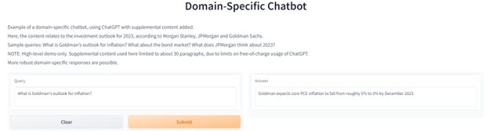

## Scaling Company Chatbots with Vector Databases
#### Introduction
A growing number of companies across industries have announced plans to customize ChatGPT for their business needs. The goal is to leverage ChatGPT's extraordinary natural language capabilities while focusing its power on company-specific documents and information. An insurance company, for example, might want to give service reps the ability to find answers to customer questions via ChatGPT -- but drawing information exclusively from official policy documents. 

Tailoring ChatGPT for such domain-specific applications can be achieved using an approach called retrieval-based augmentation. With this method, when a question is posed, relevant content from the company's knowledge base is identified and appended to the chatbot's input prompt as context. Following this, the chatbot is tasked with crafting a response based on the given context. 

This article focuses on the central role of word vectors and vector databases in the retrieval-based approach. It includes sample code for integrating a vector database into a retrieval-based model. The complete program can be found [here](https://github.com/robjm16/domain_specific_ChatGPT/blob/main/retrieval_augmented_chatbot_w_vectordb_FINAL_3_git_version.ipynb).  

(Another customization method is to retrain a bespoke version of ChatGPT on an organization's knowledge base. However, retraining brings substantial costs and risks, and lacks the precision offered by retrieval-based augmentation. Nevertheless, retrieval-based augmentation and retraining can be seen as complementary processes.)

#### Role of Word Vectors
Large language models like ChatGPT use word vectors (also known as "embeddings") to interpret queries and generate responses. Word vectors provide a numerical representation of words or phrases. For example, the word "queen" could be expressed through a sequence of numbers that illustrate its semantic proximity to words like "king," "female," and "leader." A single word vector may encompass thousands of dimensions, encapsulating context and syntax.

Retrieval-based chatbots employ word vectors to comprehend user questions, identify segments in company-supplied documents that bear the closest semantic relationship, and constrain ChatGPT's replies to information found within the chosen content segments.

#### Vector Databases: Scaling  Retrieval-Based Chatbots
A few months ago, I developed a basic retrieval-based chatbot ([article here](https://github.com/robjm16/domain_specific_ChatGPT/blob/main/DOMAIN_SPECIFIC_CHATGPT.md)) , without incorporating a vector database. The source content used was an amalgamation of the 2023 investment outlook summaries from leading Wall Street banks, combined into a single document with approximately 4,000 words.

Questions like "What will happen to the stock market in 2023?" or "What is the outlook for oil prices?" were addressed by initially pinpointing document sections that closely corresponded semantically with each question, followed by guiding ChatGPT to construct responses from these sections.  However, the initial implementation  stored word vectors in a standard Python dataframe. While this method may be viable for smaller documents, it falls short as a practical solution for storing and querying word vectors across hundreds or thousands of documents.

This is where vector databases come into play. Purpose-built to handle high-dimensional vector data, vector databases are fine-tuned for efficiently storing and querying word embeddings. In the realm of retrieval-based chatbots, this functionality allows for the speedy identification of the content most related to a user's query, even when navigating a sizable knowledge base.

### Pinecone Integration 
The updated version of my program is integrated with Pinecone, a leading cloud-based vector database provider. The program's workflow has three key steps:

- First, the program loads content from a Word document into a Python dataframe and segments it into paragraph sections, respecting certain length limitations.
- Second, it connects with the APIs of OpenAI (which developoed ChatGPT) and Pinecone to retrieve and store word vectors for each paragraph.
- Third, through a Gradio interface, it generates a prompt for ChatGPT that includes the user question and the most relevant sections of the background document. It then delivers ChatGPT's response back to the interface.

Given the focus of this article, I will skip the first section and focus on the last two sections, which deal with vector database integration.  

The initial step is to sign up for Pinecone's [free tier](https://www.pinecone.io/pricing/), which is adequate for a basic project demo. After registration, you should generate an API key for your project on Pinecone's site.

There are two ways to access Pinecone services: through its web console or via its API. The console enables the upload, query, and deletion of vector databases, along with the retrieval of specific vectors by vector ID. However, for the purposes of this article, we will connect to Pinecone through Python and the API.

In Python, you can install the Pinecone Python client using pip:

~~~python
! pip install pinecone-client 
~~~

Before utilizing Pinecone, you must initiate the client with your API key. You also need to provide the environment argument, which can be found on the Pinecone console page displaying your API key. For my instance, the environment was listed as "asia-southeast1-gcp-free."

~~~python
import pinecone
~~~
~~~python
# Initialize Pinecone
pinecone.init(api_key="your-api-key-here", environment="find-this-on-the-console-API Keys-page")
~~~

Following this, I created and connected to a Pinecone index -- where vectors for my document will be stored -- using the **'create_index'** function. I named my index "docembeddings." Since I am using OpenAI's 'text-embedding-ada-002' embedding model that returns vectors with 1,536 dimensions, I used this number for the "dimension" argument. I set the metric to "cosine" for similarity calculations in the vector space, and set shards to 1, as my dataset is relatively small (and thus there is no need to run the data across multiple machines).

~~~python
# Create Pinecone index
pinecone.create_index(name="docembeddings", dimension=1536, metric="cosine", shards=1)
~~~

Next, I associated the connection with the variable **'pinecone_client'**. This variable will now serve as my primary point of interaction with the Pinecone index. 

~~~python
# Connect to Pinecone service
pinecone_client = pinecone.Index(index_name="docembeddings")
~~~

The "pinecone_client" variable can be used to execute operations such as inserting vectors (**'pinecone_client.upsert'**), fetching vectors (**'pinecone_client.fetch'**), and querying for similar vectors (**'pinecone_client.query'**). These methods are integrated into functions discussed below.

Another useful method is **'describe_index_stats'**, which returns a dictionary showing the following statistics:

- dimension: The dimensionality of the vectors stored in the index. 
- namespaces: The number of different namespaces in the index. Namespaces allow you to partition your index into separate sections for organizational purposes.
- num_vectors: The total number of vectors currently stored in the index.
- total_bytes: The total size of the data stored in the index, in bytes.

~~~python
pinecone_client.describe_index_stats()
~~~
~~~python
Output:
{'dimension': 1536,
 'index_fullness': 0.0,
 'namespaces': {},
 'total_vector_count': 0}
~~~

These are the core methods provided by the Pinecone API.  In my program, I added a series of functions specifically designed to calculate and upload (or "upsert") vectors, and retrieve the appropriate content sections (based on their similarity to the user's question). 

~~~python
def compute_doc_embeddings(df):
    """
    Computes and uploads document embeddings for each row of a pandas DataFrame using the OpenAI document embeddings model.
    The embeddings are calculated from the text in the 'content' column of each row and then uploaded to the Pinecone index.

    Args:
        df (pandas.DataFrame): A DataFrame where each row contains a document for which to compute an embedding.
        'content' column is expected to contain the document text.

    Returns:
        dict: A dictionary that maps the index of each row (str) to its corresponding embedding vector (list of floats).
        Example: {"0": [0.12, -0.07, ..., 0.06], "1": [-0.01, 0.09, ..., 0.05], ...}
    """
    embeddings = {}
    for idx, r in df.iterrows():
        embedding = get_doc_embedding(r.content.replace("\n", " "))
        embeddings[str(idx)] = embedding
    upload_embeddings_to_pinecone(embeddings)
    return embeddings

def get_doc_embedding(text):
    """
    Generates an embedding for the provided text (considered as a single document) using the OpenAI document embeddings model.

    Args:
        text (str): The document text for which to generate an embedding.
    
    Returns:
        list: The embedding vector for the provided text, returned as a list of floats. This vector is generated by the OpenAI API.
    """
    # Call the OpenAI API to generate the embedding
    result = openai.Embedding.create(
        model=DOC_EMBEDDINGS_MODEL,
        input=[text]
    )

    return result["data"][0]["embedding"]

def upload_embeddings_to_pinecone(embeddings):
    """
    Uploads the provided document embeddings to a pre-existing Pinecone index.

    Pinecone is a vector database service that allows efficient storage, retrieval, 
    and operations on high-dimensional vectors. This function sends the generated 
    embeddings to the Pinecone index that has been previously initialized and connected.

    Args:
        embeddings (dict): A dictionary mapping document indices (as strings) to their   corresponding embeddings (as lists of floats).
    """
    # Transform the dictionary to a list of tuples
    transformed_list = [(str(key), value) for key, value in embeddings.items()]
    pinecone_client.upsert(transformed_list)

~~~

My program also includes a function (**'fetch_embeddings_from_pinecone"**) to load previously computed vectors (rather than computing them from scratch each time through).

~~~python
def fetch_embeddings_from_pinecone(df, pinecone_client):
    """
    Fetches all embeddings from the Pinecone index associated with the provided Pinecone client.
    
    Args:
        df (pandas.DataFrame): The DataFrame whose indices correspond to item ids in the Pinecone index.
        pinecone_client (pinecone.Index): The client object connected to a specific Pinecone index.
    
    Returns:
        dict: A dictionary mapping document indices to their corresponding embedding vectors.
    """
    # Get all item ids in the index
    item_ids = [str(i) for i in df.index]
    # Fetch the vectors for all items
    document_embeddings = pinecone_client.fetch(ids=item_ids)
    
    return document_embeddings    
~~~

### Question/Answering via OpenAI, Pinecone and Gradio 
Having pre-processed the text, created a Pinecone index, and computed and loaded the document's embeddings on a paragraph-by-paragraph basis into our vector database, we can move to the final section of code and related functions. This snippet launches the interface, which invokes the **'answer_query_with_context()'** and related functions (described further below).  The interface is built with Python's Gradio library, which can be used to demo machine learning applications.  

~~~python
#Launch interface
import Gradio as gr
demo = gr.Interface(
  fn=lambda query: answer_query_with_context(query, df, document_embeddings),
  inputs=gr.Textbox(lines=2,  label="Query", placeholder="Type Question Here..."),
  outputs=gr.Textbox(lines=2, label="Answer"),
  description=
      "Example of a domain-specific chatbot, using ChatGPT with supplemental content added. Here, the content relates to the investment outlook for 2023, according to       Morgan Stanley, JPMorgan and Goldman Sachs. Sample queries: What is Goldman's outlook for inflation? What about the bond market? What does JPMorgan think about         2023?",
      title="Domain-Specific Chatbot"
  )
demo.launch()  
~~~

This code initiates the following workflow (see functions further below):   
1.)   Retrieve embeddings for the user query (**'get_query_embedding'** which in turn invokes **'get_embedding()'**) via an OpenAI API call.  
2.)   Compute vector similarities between the query and the document sections (**'vector_similarity()'**) using a Pinecone API call.  
3.)   Arrange the document sections in order of their similarity to the query (**'order_doc_section_by_query_similarity()'**).  
4.)   Construct a prompt for ChatGPT that includes the user query, the document sections most closely related to the query and instructions for how to respond (**'construct_prompt()'**).    
5.)   Generate ChatGPT's response to the query (via **'answer_query_with_context()'**) and display it.

~~~python
def get_query_embedding(text):
   """
    Generates an embedding for the given text using the OpenAI query embeddings model.
    
    Args:
        text (str): The text for which to generate an embedding.
    
    Returns:
        numpy.ndarray: The embedding for the given text.
    """
   return get_embedding(text, QUERY_EMBEDDINGS_MODEL)

def get_embedding(text, model): 
    """
    Generates an embedding for the given text using the specified OpenAI model.
    
    Args:
        text (str): The text for which to generate an embedding.
        model (str): The name of the OpenAI model to use for generating the embedding.
    
    Returns:
        numpy.ndarray: The embedding for the given text.
    """
    result = openai.Embedding.create(
      model=model,
      input=[text]
    )
    return result["data"][0]["embedding"]

def answer_query_with_context(query, df, document_embeddings, show_prompt: bool = False):
    """
    Answer a query using relevant context from a DataFrame.
    
    Args:
        query (str): The query to answer.
        df (pandas.DataFrame): A DataFrame containing the document sections.
        document_embeddings (dict): A dictionary mapping document indices to their corresponding embedding vectors.
        show_prompt (bool, optional): If `True`, print the generated prompt before using it for generating a response.
    
    The function constructs a prompt based on the query and the content in the DataFrame. This constructed prompt is then
    used with the OpenAI Completion API to generate a response.
    
    Returns:
        str: The generated response to the query.
    """   

    prompt = construct_prompt(query, df)

    if show_prompt:
        print(prompt)

    response = openai.Completion.create(
                prompt=prompt,
                **COMPLETIONS_API_PARAMS
                )

    return response["choices"][0]["text"].strip(" \n")

def construct_prompt(question, df):
    """
    Construct a prompt for answering a question using the most relevant document sections.
    The function generates an embedding for the question and retrieves the top 5 most similar 
    document sections based on cosine similarity from Pinecone. It adds these sections to 
    the prompt until reaching the maximum allowed length. Newline characters in the document 
    sections are replaced with spaces to prevent format issues.
    
    Args:
      question (str): The question to answer.
      df (pandas.DataFrame): A DataFrame containing the document sections.
    
    Returns:
      str: The constructed prompt, including the question and the relevant context.
    """
  
    # Get the query embedding from the OpenAI api
    xq = openai.Embedding.create(input=question, engine=QUERY_EMBEDDINGS_MODEL)['data'][0]['embedding']

    # Get the top n document sections related to the query from the pinecone database
    res = pinecone_client.query([xq], top_k=5, include_metadata=True)

    # Extract the section indexes for the top n sections
    most_relevant_document_sections = [int(match['id']) for match in res['matches']]

    chosen_sections = []
    chosen_sections_len = 0
    chosen_sections_indexes = []
     
    for section_index in most_relevant_document_sections:
        # Add contexts until we run out of space.        
        document_section = df.loc[section_index]
        
        chosen_sections_len += document_section.tokens + separator_len
        if chosen_sections_len > MAX_SECTION_LEN:
            break
            
        chosen_sections.append(SEPARATOR + document_section.content.replace("\n", " "))
        chosen_sections_indexes.append(str(section_index))
            
     header = """Answer the question as truthfully as possible using the provided context, and if the answer is not contained within the text below, say "Sorry, I don't know."\n\nContext:\n"""

    full_prompt = header + "".join(chosen_sections) + "\n\n Q: " + question + "\n A:"

    return full_prompt
~~~

Finally, here is a screenshot of the chatbot's interface:  

### Conclusion  
Domain-specific chatbots are poised to  revolutionize the way companies and other organizations manage knowledge and engage with customers. Efficiently scaling such chatbots is a key consideration.  Vector databases can play an instrumental role, helping companies to store, query and manage vectors to accommodate their expansive and continually growing knowledge bases.    
